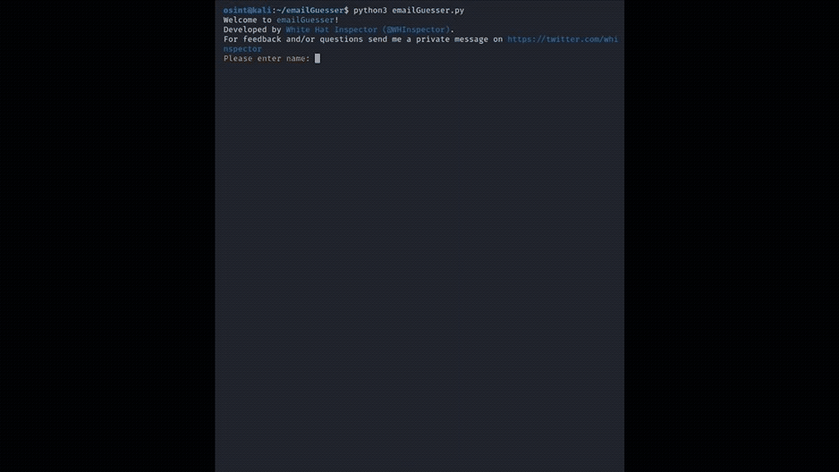

# emailGuesser
You 've probably heard of brute-force attacks to find a password. How about brute-force "guessing" a target's email address?

Introducing emailGuesser!

**emailGuesser** is an Open Source Intelligence (OSINT) tool which helps users "guess" their target's email address based on multiple inputs and preferences.



**DISCLAIMER**: This tool is for research purposes only.
Use this tool responsibly and ethically! I am not reliable for any abuse or harm, you may cause using it.

It is highly advisable to run the script using a VPN to enhance your privacy protection! It will also ensure your IP will not get banned due to continuous requests to the sites used.

## Installation
To install this project run: 

```bash
# clone the repo
$ git clone https://github.com/WhiteHatInspector/emailGuesser

# change the working directory to emailGuesser
$ cd emailGuesser

# install requirements
python3 -m pip install -r requirements.txt

# run the script
$ python3 emailGuesser.py
```

## Usage
The script will search for potential e-mail addresses of a target according to inputs given by the user. It will try "guessing" potential e-mail addresses of the target by using the most common formats used in e-mail addresses (e.g. jsmith@domain or j.smith@domain).

The script asks for the following user inputs (mandatory inputs are marked with asterisk):
```
Name*: Insert the first name of your target (e.g. john)

Surname*: Insert the last name of your target (e.g. smith)

Birth year: Insert birth year in its full form (e.g. 1984), otherwise the script will assume you don't know the exact birth year. 
You can also input "no" if you don't know the year of birth

Username: Insert any known username of the target (only one). You can also input "no" if you don't know any username.

Add extra e-mail formats: Use static or dynamic formats for the username of the e-mail (part of e-mail before the @ symbol).
This option will add usernames to an already pre-configured list in the script (see link below for pre-configured usernames table)
If you want to add static formats just input them (e.g. josmi94) but if you want to use dynamic formats then use any structure 
containing the following: 
- f!! (first char of the target's first name), 
- first!! (target's first name), 
- l!! (first char of the target's last name) and 
- last!! (target's last name).
Example: f!!+last!! --> j+smith@domain

Add domains: Input all domains that you wish to conduct a search to, separated by a single comma (e.g. yahoo.com,gmail.com)
```
The script will check the structure of the e-mail addresses that were automatically created and will query the valid ones to:
1. Skype (using the skypli.com site)
2. Breached databases (using the haveibeenpwned.com site)

You can find a list of preconfigured e-mail formats that the tool will search, even if not specified otherwise by the user, [here](https://github.com/WhiteHatInspector/emailGuesser/blob/main/Preconfigured%20e-mail%20formats.md).

All e-mail addresses that are found in any of these sites, will return to the user at the end of the script, containing further info.

The script also provides a "results.txt" and a "resultscsv.csv" file at the end, that is saved to the same folder as the .py file, that the user can use for any further investigation.

The script runs continuously so after each search, it will restart from the beggining asking for the next inputs.

## FAQs
**Q: Why do you search in Skype for email addresses?** <br/>
A: Skype allows you to search an e-mail addresses and immediately matches that to a name/username/birthdate/country. Meaning you get an immediate way to eliminate
potential e-mail addresses that do not belong to your target. Until now I have not found other similar tools for that but I am working on it

**Q: Why sometimes Skype results in multiple users, using the same e-mail address?** <br/>
A: For now I can only guess Skype doesn't verify its users e-mail addresses (used for registration), therefore anyone can use whatever e-mail address to register. I will check this more and update this section.

**Q: Why do you search haveIbeenPwned for breached data?** <br/>
A: haveIbeenPwned is a trustworthy site containing most known breach databases. It also allows you to search indefinitely for free and I want to keep this tool
free for anyone to use without having to pay for commercial products or APIs

**Q: Why are your queries slow for each e-mail address produced?** <br/>
A: In order to avoid getting an IP flag for a potential DDoS attack, I am using a random waiting time between 5-8 seconds before each request in these sites.
Unfortunately, this makes the processing time higher than just a second for each query. I am working on it, to make it run faster. Will update if I figure a way to do so.

**Q: Why do you generate a .txt file with results at the end?** <br/>
A: OSINT investigators can use this output to run their own searches after the end of the script. I will post here in the future, for ways a .txt output of found e-mails can help you in your OSINT investigations.

**Q: I run the script but I didn't find the e-mail address of my target. Why?** <br/>
A: The script checks all e-mail formats that users tend to use most often. This means that if your target doesn't use a common format for his e-mail address, you won't be able to find it this way unless you have a clue of its format (so that you can input that format yourself). Also this tool has more chances of finding the e-mail address of your target, if your target has a more unique name. The more unique name a target has, the better. For example, John Smith is a common name and your target will most probably try using other e-mail formats when registering his e-mail address, because the common formats are probably already taken, at the time of his e-mail registration.

**Q: I believe you could have implemented this script in a better way. What can I do about it?** <br/>
A: Please feel free to contact me or contribute yourself in this project, by checking the next sections.

**Q: Do you actively maintain this tool?** <br/>
A: Yes. In case this changes, I will update this readme file.

## Contributing
If you would like to contribute to this project, you are welcome to do so. Each and every contribution is greatly valued! Keep in mind that this tool must remain
free to use for everyone, so don't use paid APIs (like Dehashed) but try finding a work around.

Right now I am working on the following TODO list:
- [ ] Find more or alternative sites to search-query that yield immediate results about the identity of the owner of an e-mail address, such as name/username etc (like Skype does)
- [ ] Find more or alternative sites/tools to search-query in order to validate e-mail addresses (not breached data)
- [ ] Find a way to query haveIbeenPwned (or similar) site faster without having to wait for 5-8 random time duration and not getting IP banned (public proxies?)
- [ ] Add more username formats that people use often before the @ symbol on e-mails and add them to the tool
- [ ] Allow users to parse a preconfigured .txt file with email formats or/and domains, so that they can automatically input the same preferences every time they run a search, without having to manually input the same things each time
- [X] Output a results.txt and a results.csv file with useful formats for an OSINT investigator
- [ ] Remove preconfigured e-mail formats that are actually not often used by people in their e-mail addresses, to reduce execution time
- [ ] Reduce execution time by any means necessary (Right now it has an average run time of 8-10 seconds/e-mail address searched)
- [ ] Add new functions and a menu with different choices

## Feedback and Questions
For any feedback or questions please contact me on https://twitter.com/whinspector or theinspector32@protonmail.com

## License
MIT © 2021 emailGuesser <br/>
Created by [White Hat Inspector](https://twitter.com/whinspector)

                                                        `-/+.   `++:.                                      
                                                  .:+sdNMMMMMh+yNMMMMNdyo/.                                
                                                 -MMMMMMMMMMMMMMMMMMMMMMMMM+                               
                                                 yMMMMMMMMMMMMMMMMMMMMMMMMMN`                              
                                                -MMMMMMMMMMMMMMMMMMMMMMMMMMM+                              
                                                yMMMMMMMMMMMMMMMMMMMMMMMMMMMN                              
                                               .MMMMMMMMMMMMMMMMMMMMMMMMMMMMM+                             
                                               yMMMMMMMMMMMMMMMMMMMMMMMMMMMMMm`                            
                                              .MMMMMMMMMMMMMMMMMMMMMMMMMMMMMMM+                            
                                              yMMMMMMMMMMMMMMMMMMMMMMMMMMMMMMMm                            
                                             .MMMMMMMMMMMMMMMMMMMMMMMMMMMMMMMMM/                           
                                        ..   /MMMMMMMMMMMMMMMMMMMMMMMMMMMMMMMMMs   ..`                     
                              `.:/oshdNMMMd+` `+dMMMMMMMMMMMMMMMMMMMMMMMMMMMms.  /hMMMNdhso/:.`            
                            `+dMMMMMMMMMMMMMMh+. ./sdNMMMMMMMMMMMMMMMMMMmy+. `/yNMMMMMMMMMMMMMms.          
                             ` `/ymMMMMMMMMMMMMMmy+:` .:/osyyhhhyyso+:.``-+smMMMMMMMMMMMMMNh+.  `          
                         ./yNo     -odMMMMMMMMMMMMMMMNdyso+/::::://osydmMMMMMMMMMMMMMMMms:     :Mh+-       
                       +dMMMMN.       `/yNMMMMMMMMMMMMMMMMMMMMMMMMMMMMMMMMMMMMMMMMMNh+.        dMMMMms`    
                      .dMMMMMMh`o+:.`     -odMMMMMMMMMMMMMMMMMMMMMMMMMMMMMMMMMMMms:     `-/+/ oMMMMMMN:    
                        /mMMMMMy-NMMMNdhs    `/ymMMMMMMMMMMMMMMMMMMMMMMMMMMMNh+.   `yhmNMMMd`/MMMMMNo`     
                          oNMMMMy-NMMMMMMh       .+yNMMMMMMMMMMMMMMMMMMMNho-      `mMMMMMMd`/MMMMMy.       
                           `sMMMMh-mMMMMMMy          ./ohmMMMMMMMMMNds+-         `dMMMMMMh`oMMMMh-         
                             .yMMMd-hMMMMMMy  ``           `.-:--.`          `. `dMMMMMMs`sMMMd:           
                               -dMMN:oMMMMMMs `:/::-.``               ``.--:/:``dMMMMMN/`dMMm/             
                                 :mMM+:NMMMMMs  -////////:::::--:::::///////:``hMMMMMd.:NMN+               
                                   +NMh-hMMMMMs  ://////////////////////////` hMMMMMs`oMMs`                
                                    `dMN:+MMMMM+ `:////////////////////////. yMMMMN:.dMN-                  
                                  :yNMMMMs-dMMMM+ `://////////////////////. yMMMMh`/NMMMMh/`               
                                /NMMMMMMMMm:oMMMMo `:////////////////////.`hMMMN/.hMMMMMMMMMs              
                                 .omMMMMMMMMs-dMMMh. ./////////////////-`-mMMMh./NMMMMMMMNy:               
                                    -sNMMMMMMm:oMMMNo``.:////////////-``yMMMN/.hMMMMMMNh/`                 
                                       :sNMMMMMs:dMMMN+` .:///////:-``sNMMMy`+NMMMMNh/`                    
                                          :sNMMMm/+NMMMNo` `-///:. .sNMMMm:.dMMMNy/`                       
                                             :sNMMy-hMMMMMo  `.`  yMMMMMs`oMMMh/`                          
                                                :yMN+/NMMMN`     -MMMMd-:mMd+`                             
                                                  `+md:sMMM/     sMMNo`yNs.                                
                                                     :ys:mMy     mMh./h/                                   
                                                       .o:oN`   -N/.o:                                     
